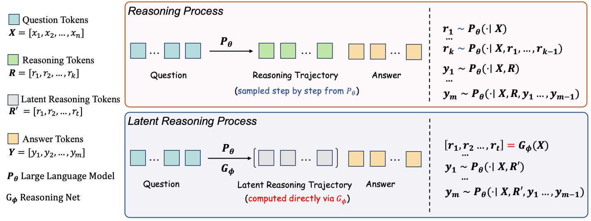

# Latent Reasoning

Official code for the paper *"Rethinking LLM Reasoning: From Explicit Trajectories to Latent Representations"* (ICLR 2026).

## Overview

Latent Reasoning replaces explicit Chain-of-Thought (CoT) tokens with a **continuous latent trajectory** generated by a lightweight reasoning network. Instead of producing long textual reasoning traces, the model:

1. Encodes the prompt through the base LLM to obtain hidden states.
2. A **Reasoning Network** (a small transformer, e.g. Qwen3-Embedding-0.6B) processes these hidden states together with learnable latent trajectory parameters to produce latent reasoning embeddings.
3. These latent embeddings are concatenated with the prompt embeddings and fed back into the base LLM for decoding.

This achieves competitive reasoning performance while significantly reducing generation length.

## Architecture


The paper explores multiple reasoning network architectures (see `modeling/reasoning_net.py`):

- **MLPReasoningNet**: Simple MLP-based reasoning network
- **TransformerReasoningNet**: Uses a small pre-trained transformer as the reasoning backbone

The current training pipeline uses **TransformerReasoningNet** (see `modeling/reason.py`), which concatenates the full prompt hidden states with the latent trajectory before processing through the reasoning transformer, enabling richer context modeling.

## Project Structure

```
├── sft.py                          # SFT training entry point
├── rft.py                          # RFT (GRPO) training entry point
├── modeling/
│   ├── reason.py                   # Core model: TransformerReasoningNet + LatentTransformerReasoningModel
│   └── reasoning_net.py            # Paper's original reasoning network variants (MLP, Transformer)
├── trainer/
│   └── grpo_trainer.py             # Custom GRPO trainer for latent reasoning
├── inference/
│   ├── run_inference.py            # Interactive inference script
│   └── run_inference.sh            # Inference launch script
├── utils/
│   ├── load_data.py                # Dataset loading utilities
│   └── reward_func.py              # Reward functions for RFT (accuracy, length penalty)
├── scripts/
│   ├── train_sft_1.5B.sh           # SFT training script for 1.5B model
│   ├── train_sft_7B.sh             # SFT training script for 7B model
│   ├── train_rft_1.5B.sh           # RFT training script for 1.5B model
│   └── train_rft_7B.sh             # RFT training script for 7B model
├── configs/                        # Accelerate / DeepSpeed / FSDP configs
│   ├── deepspeed_zero1.yaml
│   ├── deepspeed_zero2.yaml
│   ├── deepspeed_zero3.yaml
│   ├── single_gpu.yaml
│   ├── multi_gpu.yaml
│   └── ...
├── trl/                            # Modified TRL library
└── README.md
```

## Quick Start

### Installation

```bash
pip install -r requirements.txt
```

The training code supports loading datasets directly from the Hugging Face Hub. If you keep local cached or preprocessed
copies under `./data/datasets`, you can point the loader to that directory with `LRT_DATA_ROOT=/path/to/data/datasets`.

`MATH-DATA` is a local alias that expects a saved dataset at
`$LRT_DATA_ROOT/Deepseek-R1-Distill-Math-Reasoning`.

### SFT Training

**Single-node multi-GPU training (1.5B model):**

```bash
bash scripts/train_sft_1.5B.sh
```

Key SFT training arguments:

| Argument | Default | Description |
|---|---|---|
| `--slow_thinking_model_path` | `deepseek-ai/DeepSeek-R1-Distill-Qwen-1.5B` | Base LLM (frozen during training) |
| `--reasoning_net_path` | `Qwen/Qwen3-Embedding-0.6B` | Reasoning network backbone |
| `--latent_trajectory_length` | `256` | Number of latent trajectory tokens |
| `--dataset_name` | `open-r1/OpenR1-Math-220k` | Training dataset |
| `--prompt_max_length` | `1024` | Max prompt token length |
| `--completion_max_length` | `2048` | Max completion token length |
| `--learning_rate` | `3e-4` | Learning rate |

### RFT Training (GRPO)

After SFT, you can further improve the model with reinforcement fine-tuning using GRPO:

```bash
bash scripts/train_rft_1.5B.sh
# or
bash scripts/train_rft_7B.sh
```

Key RFT-specific arguments:

| Argument | Default | Description |
|---|---|---|
| `--reward_metric` | `accuracy` | Reward function to use |
| `--beta` | `0.0` | KL penalty coefficient (0 = no KL regularization) |
| `--num_generations` | `8` | Number of rollout generations per prompt |
| `--temperature` | `1.0` | Sampling temperature for rollout |
| `--clip_eps_low` | `0.2` | DAPO-style asymmetric clipping lower bound |
| `--clip_eps_high` | `0.28` | DAPO-style asymmetric clipping upper bound |

### Inference

```bash
bash inference/run_inference.sh
```

## Datasets

The paper uses the following datasets for training:

- [**open-r1/OpenR1-Math-220k**](https://huggingface.co/datasets/open-r1/OpenR1-Math-220k) — Math reasoning dataset (220k samples)
- [**agentica-org/DeepScaler-Preview-Dataset**](https://huggingface.co/datasets/agentica-org/DeepScaler-Preview-Dataset) — Math reasoning dataset

Additional datasets supported in this codebase:

- [**BytedTsinghua-SIA/DAPO-Math-17k**](https://huggingface.co/datasets/BytedTsinghua-SIA/DAPO-Math-17k) — Math reasoning (17k samples)
- [**stepfun-ai/Step-3.5-Flash-SFT**](https://huggingface.co/datasets/stepfun-ai/Step-3.5-Flash-SFT) — General instruction tuning dataset

## Models

The framework supports various base models and reasoning networks:

**Base Models (frozen):**
- `deepseek-ai/DeepSeek-R1-Distill-Qwen-1.5B`
- `deepseek-ai/DeepSeek-R1-Distill-Qwen-7B`

**Reasoning Networks:**
- `Qwen/Qwen3-Embedding-0.6B` (default, recommended)

## Training Pipeline

The training follows a multi-stage process:

1. **Stage 1 — Instruction Tuning (SFT)**: Train the reasoning network on general instruction-following data (e.g., `stepfun-ai/Step-3.5-Flash-SFT`). *Note that the results reported in this paper do not include this training stage.*
2. **Stage 2 — Math Reasoning (SFT)**: Fine-tune on math-specific datasets (e.g., `open-r1/OpenR1-Math-220k`)
3. **Stage 3 — Reinforcement Fine-Tuning (RFT)**: Further improve with GRPO using accuracy rewards (e.g., on `BytedTsinghua-SIA/DAPO-Math-17k`)

During training, only the reasoning network parameters are updated; the base LLM remains frozen.

## Citation

If you find this work useful, please cite our paper:

```bibtex
@inproceedings{
jiang2026rethinking,
title={Rethinking LLM Reasoning: From Explicit Trajectories to Latent Representations},
author={Cong Jiang and Xiaofeng Zhang and Zheng Zhang and Fangzhi Zhu and XiaoWei Chen and Junxiong Zhu},
booktitle={The Fourteenth International Conference on Learning Representations},
year={2026},
url={https://openreview.net/forum?id=CbK7lYbmv8}
}
```

## License

This project is released under the MIT License.
